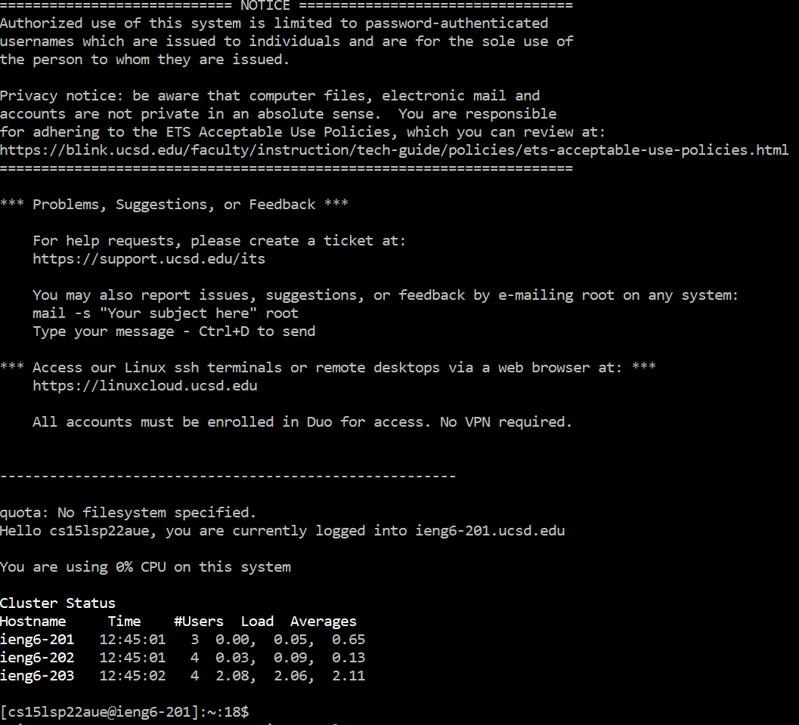
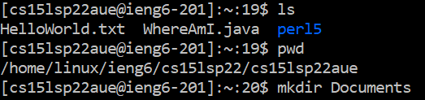
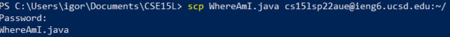
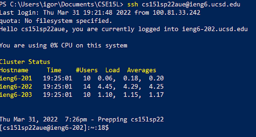
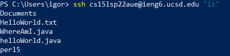

# Lab Report 1, Week 2

 

## Installing VSCode

Go to the [website](https://code.visualstudio.com/download) for VSCode and download the appropriate version. Follow the instructions in the installer to set it up.

Once VSCode is installed, you should be able to open it and see a screen like this:

 

 
 

## Connecting Remotely
To connect to the remote server, open up a terminal in VSCode or use your command prompt. Type the command `ssh cs15lsp22zz@ieng6.ucsd.edu`

Be sure tp replace `zz` with the letters associated with your account. If connecting for the first time, answer yes when prompted. Then type in your password. Once you see this screen, you are connected:

 

 
 

## Trying some commands

There are several commands that can be tried; I will be demonstrating `ls`, `pwd`, and `mkdir`.

* `ls`: this command lists all the files and directories in your current directory
* `pwd`: this command prints the file pathway of your working directory.
* `mkdir`: this command creates a new directory within in your working directory

 
 

## Moving files with `scp`

The command `scp` copies a file from your machine to the server. 

First, create a file in any directory on your machine. Then, change your working directory to the directory in which the file is in using `cd`. Finally, use the command `scp <file name with extension> cs15lsp22zz@ieng6.ucsd.edu:~/`

You should see this if `scp` worked successfully:

 
 

## Setting an SSH key
To generate a key, type the command ` ssh-keygen` on your local  machine. Accept the default file location and do not enter a passphrase. Then enter `ssh-add ~<file location>`. You should then login to the server and type `mkdir .ssh`. Finally, return to your local machine and enter `scp /Users/<user-name>/.ssh/id_rsa.pub
cs15lsp22zz@ieng6.ucsd.edu:~/.ssh/authorized_keys`, filling in the file location and username as appropriate.

 
 

## Optimizing remote running
To access the server and run a command from your machine, type `ssh cs15lsp22zz@ieng6.ucsd.edu "<your command here>"`.

You can add multiple commands by separating them with `;`. Here is an example:

